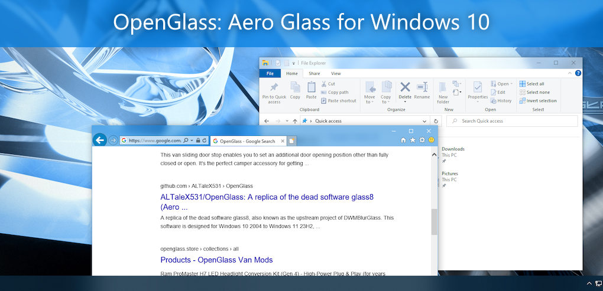

# OpenGlass
A replica of the dead software glass8, also known as the upstream project of [DWMBlurGlass](https://github.com/Maplespe/DWMBlurGlass).  

This branch does not rely on `dcomp` and `Windows.UI.Composition` and instead uses raw Direct2D to leverage better performance than the master branch, however due to it's early nature you may encounter more bugs and crashes. Currently this branch ONLY supports Windows 10 2004-22H2.
> [!IMPORTANT]  
> This software is intended for advanced users only. If you are a beginner and you do not have deeper knowledge of Windows (such as registry editing etc.) you should not install this software.  
> For the average users, you should consider using [DWMBlurGlass](https://github.com/Maplespe/DWMBlurGlass).

> [!WARNING]   
> OpenGlass does NOT support and is NOT intended to support Windows Insider Preview, so if you want to use it in these Windows versions please do it at your own risk.

## Demonstration


> *.msstyles theme used for screenshots: [Aero10 by vaporvance](https://www.deviantart.com/vaporvance/art/Aero10-for-Windows-10-1903-22H2-909711949)*

> *additional software used: [Windhawk](https://windhawk.net/), [Aero Window Manager](https://github.com/Dulappy/aero-window-manager) by @Dulappy*
## How to use this software
1. Extract the files from the Release page to `C:\`, but please don't put them in `C:\Users\*`, otherwise OpenGlass won't work properly.
2. Run `install.bat` as administrator, this will create a scheduled task for you to run the OpenGlass helper process on boot, which will monitor and automatically inject its component into Dwm.
3. Run `startup.bat` as administrator, this will run the helper process manually.
4. When you use it for the first time or just after updating your system, OpenGlass will try to download the symbol files and you will see its download progress bar in the taskbar, but please don't close it and be patient for about 15s. When the symbol files are ready, enjoy!
5. When you want to stop using OpenGlass or update the version of OpenGlass, running `shutdown.bat` will remove the effects of OpenGlass for you and exit the helper process. At this time, you can either replace the OpenGlass files or continue to run `uninstall.bat` and manually delete the remaining files to complete the uninstallation.
6. When you experience a crash, OpenGlass is supposed to generate a large memory dump file in the `dumps` directory of the folder where it is located, please submit it to the developer if possible, this can help fix known or potential issues.

## Documentation
The legacy branch can use some of the features of the master branch. Options which are not listed below are not supported in the Legacy branch, vice versa. 
> [!NOTE]  
> Starting from 1.2, if the GlassType is 0x1, then it will use the value of `ColorizationColor`, `ColorizationAfterglow`, `ColorizationBlurBalance`, `ColorizationColorBalance`, `ColorizationAfterglowBalance`, unless an override key is made as shown below.

> [!IMPORTANT]  
> Unless specified, the options below are stored in `HKEY_CURRENT_USER\SOFTWARE\Microsoft\Windows\DWM` and `HKEY_LOCAL_MACHINE\SOFTWARE\Microsoft\Windows\DWM`. OpenGlass prefers to read the settings in the HKCU.


**Colorization settings**

| Key Name | Type | Description | 
| -------- | ---- | ----------- |
| ColorizationColorOverride | DWORD | Overrides the default Windows `ColorizationColor`. The color is in ARGB (i.e 0x6B74B8FC). If this is not set, it'll use the equivalent original registry key. |
| ColorizationAfterglowOveride | DWORD | Overrides the default Windows `ColorizationAfterglow`. The color is in ARGB (i.e 0x6B74B8FC). If this is not set, it'll use the equivalent original registry key.  |
| ColorizationColorBalanceOverride | DWORD | Overrides the default Windows `ColorizationColorBalance`. This key is typically controlled by the intensity slider in Control panel. If you were using the old shader fork previously, this is the equivalent to `og_ColorizationColorBalance`. If this is not set, it'll use the equivalent original registry key. |
| ColorizationAfterglowBalanceOverride | DWORD | Overrides the default Windows `ColorizationAfterglowBalance`. This key is typically controlled by the intensity slider in Control panel. If you were using the old shader fork previously, this is the equivalent to `og_ColorizationColorBalance`. If this is not set, it'll use the equivalent original registry key. |
| ColorizationBlurBalanceOverride | DWORD | Overrides the default Windows `ColorizationBlurBalance`. This key is typically controlled by the intensity slider in Control panel. If you were using the old shader fork previously, this is the equivalent to `og_ColorizationBlurBalance`. If this is not set, it'll use the equivalent original registry key. |

**Glass settings**
| Key Name | Type | Description | 
| -------- | ---- | ----------- |
| GlassType | DWORD | The type of backdrop effect. Currently, only 2 options are supported: 0x0=Basic blur and 0x01=Aero |
| GlassOverrideAccent | DWORD | Overrides surfaces with accent policies with OpenGlass effects, I.E: the taskbar. Set to 1 to enable. |
| EnableGeometryMerging | DWORD | Merges multiple  blur surfaces to render as one. Most notably, this will eliminate the "artifact" near the titlebar edges. <br><br>**!! THIS OPTION MAY HAVE A SEVERE IMPACT ON PERFORMANCE. USE AT YOUR OWN RISK. !!** |
| ColorizationGlassReflectionIntensity | DWORD | Controls the opacity of the glass streaks effect in the window. |
| ColorizationGlassReflectionParallaxIntensity | DWORD | Controls intensity of the parallax effect (I.E when moving the windows side to side) of the glass streaks. | 
| BlurDeviation | DWORD | Controls the radius (intensity) of the gaussian blur effect. |
| TextGlowSize | DWORD | Controls the size of the titlebar text glow effect. |
| RoundRectRadius | DWORD | Controls radius of the blur behind, like a rounded rectangle. Win8 = 0, Win7 = 12 | 
| CustomThemeMsstyle | String | path to msstyle file. | 
| CustomThemeMsstyleUseDefaults | DWORD | Color scheme uses the result from GetThemeDefaults | 
| EnableFullDirty | DWORD | Make the dirty region extend to the entire desktop by using a hack. This will eliminate the "flickering" caused by redrawing due to missing glass safety zones, thus useful for those using a high blur radius. As a price, your entire desktop is rendered instead of just the necessary regions, but the occlusion optimization still works fine. <br><br>**!! THIS OPTION DEFINITELY HAVE A IMPACT ON PERFORMANCE. USE AT YOUR OWN RISK. !!** |


> [!TIP]  
> Check out the code to discover more details!


## How to reload the configuration
OpenGlass does not provide any GUI nor commands to explicitly reload the configuration, you may consider using glass8's heritage `AeroGlassGUI.exe` to refresh some of the settings.   
However, it's actually quite easy to do so in C/C++.
```c++
PostMessage(FindWindow(TEXT("Dwm"), nullptr), WM_THEMECHANGED, 0, 0);            // refresh part of the settings related to theme
PostMessage(FindWindow(TEXT("Dwm"), nullptr), WM_DWMCOLORIZATIONCHANGED, 0, 0);  // refresh part of the settings related to color/backdrop
```

## About compatibility
- OpenGlass cannot be used with DWMBlurGlass as they belong to the same type of software.
- OpenGlass does not support rendering borders that are included in accents, so some softwares that turn on borders for accents such as TranslucentFlyouts will not be able to display borders.
- OpenGlass can be used with [AWM](https://github.com/Dulappy/aero-window-manager), but `CustomThemeMsstyle` will not be available and you need to be careful about the order in which you execute and stop.
    - **Good Example😘**:  

        execute OpenGlass  
        execute AWM  
        ...  
        stop AWM  
        stop OpenGlass  

        (The first to execute should be stopped at last.)
    - **Bad Example😭**:  
        execute OpenGlass  
        execute AWM  
        ...  
        stop OpenGlass  
        stop AWM  

        In this case you are likely to get a crash of DWM or the other software working abnormally.
- OpenGlass can be used with most Windhawk mods, but some may have compatibility issues, especially community or personally written mods that can't be found in the windhawk marketplace.
- This branch cannot be used with the master branch.

## Dependencies and References
### [Banner for OpenGlass](https://github.com/ALTaleX531/OpenGlass/discussions/11)
Provided by [@aubymori](https://github.com/aubymori)  
Wallpaper: [metalheart jawn #2](https://www.deviantart.com/kfh83/art/metalheart-jawn-2-1068250045) by [@kfh83](https://github.com/kfh83)
### [Microsoft Research Detours Package](https://github.com/microsoft/Detours)  
Detours is a software package for monitoring and instrumenting API calls on Windows.  
### [VC-LTL - An elegant way to compile lighter binaries.](https://github.com/Chuyu-Team/VC-LTL5)  
VC-LTL is an open source CRT library based on the MS VCRT that reduce program binary size and say goodbye to Microsoft runtime DLLs, such as msvcr120.dll, api-ms-win-crt-time-l1-1-0.dll and other dependencies.  
### [Windows Implementation Libraries (WIL)](https://github.com/Microsoft/wil)  
The Windows Implementation Libraries (WIL) is a header-only C++ library created to make life easier for developers on Windows through readable type-safe C++ interfaces for common Windows coding patterns.  
### [Interop Compositor](https://blog.adeltax.com/interopcompositor-and-coredispatcher/)
Saved me some decompiling and reverse engineering time thanks to ADeltaX's blog!
### [Win32Acrylic](https://github.com/ALTaleX531/Win32Acrylic)
Win2D sucks!
### [AcrylicEverywhere](https://github.com/ALTaleX531/AcrylicEverywhere)
The predecessor of this project.
### [Loading Visual Styles Per-Application](https://winclassic.net/thread/2178/loading-visual-styles-application)
It is possible for an application to load a style on a per-application basis using an undocumented API.
